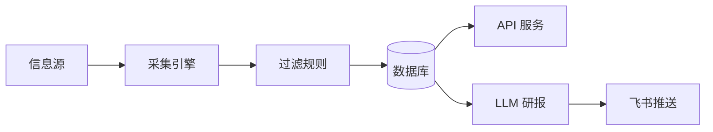

# MyWind 投研助手 - 架构分析与优化报告

## 一、项目核心流程



**一句话总结**：从多个财经网站抓数据 → 按关键词过滤 → 存数据库 → 对外提供 API + 生成研报推送飞书

---

## 二、五大核心模块

### 模块 1：信息源层

**当前支持的数据源**：

| 类型 | 数据源 | 采集方式 |
|------|--------|----------|
| 实时快讯 | 财联社、华尔街见闻、新浪财经 | HTTP API |
| 社交情绪 | 雪球、东财股吧 | HTTP + Cookie |
| 官方信披 | 巨潮资讯、披露易 | HTTP POST |
| 反爬网站 | 今日头条、微信公众号、小红书 | Puppeteer + OCR |
| 搜索增强 | 百度、Bing | Puppeteer |
| 研报平台 | 发现报告、研报客、格隆汇 | HTTP/Puppeteer |

**代码位置**：
- `services/scraperService.js` - 核心采集服务
- `services/visualScraper.js` - OCR 视觉采集
- `services/scrapers/` - 13 个专用爬虫

---

### 模块 2：采集引擎

**两种采集模式**：

| 模式 | 技术 | 适用场景 |
|------|------|----------|
| **HTTP 直接抓取** | axios + cheerio | 普通网站、API |
| **浏览器模拟** | Puppeteer + Stealth | 有反爬的网站 |
| **+ OCR** | Tesseract.js | 今日头条等图文混排 |

**定时调度**：

| 任务 | 频率 |
|------|------|
| 实时采集 | 每 5 分钟 |
| 深度采集 | 每 30 分钟 |
| 视觉采集 | 每天 4 次 |
| 研报采集 | 每 10 分钟 |

**代码位置**：`services/schedulerService.js`

---

### 模块 3：过滤规则

**三层关键词矩阵**：

```
┌─────────────────────────────────────────────┐
│ 核心层 (direct)                             │
│ - 股票代码、简称                            │
│ - 匹配后：🔴 红色立即预警                   │
├─────────────────────────────────────────────┤
│ 关联层 (related)                            │
│ - 高管姓名、子公司                          │
│ - 匹配后：🔵 蓝色提醒                       │
├─────────────────────────────────────────────┤
│ 板块层 (context)                            │
│ - 行业、竞争对手                            │
│ - 用于：研报背景聚合                        │
└─────────────────────────────────────────────┘
```

**白名单过滤**：只有包含白名单关键词的新闻才会入库

**代码位置**：
- `models/Stock.js` - 矩阵定义
- `config/filterConfig.js` - 白名单过滤

---

### 模块 4：数据存储

**MongoDB 数据模型**：

| 模型 | 用途 |
|------|------|
| `News` | 新闻/公告，MD5 去重 |
| `Stock` | 股票 + 三层关键词矩阵 |
| `Report` | AI 生成的研报 |
| `ResearchReport` | 采集的第三方研报 |
| `Account` | 托管账号（AES-256 加密） |
| `AlertRecord` | 推送记录 |
| `MarketStats` | 市场指标数据 |

**代码位置**：`models/` 目录

---

### 模块 5：输出层

#### 5.1 API 服务

**主要端点**：

| 端点 | 功能 |
|------|------|
| `GET /api/news` | 获取新闻列表（支持过滤） |
| `GET /api/stocks` | 获取股票列表 |
| `GET /api/reports` | 获取研报列表 |
| `POST /api/reports/generate` | 手动生成研报 |

**代码位置**：`routes/` 目录（已拆分为 10 个模块）

#### 5.2 LLM 研报生成

**流程**：
1. 聚合股票相关新闻（核心层 + 板块层）
2. 构建分析师 Prompt
3. 调用 DeepSeek API
4. 解析结构化输出（评级、目标价等）
5. 推送到飞书

**代码位置**：`services/aiService.js`

#### 5.3 飞书推送

**三级分色卡片**：
- 🔴 红色：利空（立案、退市等）
- 🟢 绿色：利好（重组、回购等）
- 🔵 蓝色：关注（减持、股东大会等）

**代码位置**：`services/notificationService.js`

---

## 三、现有问题分析

### 🔴 严重问题

| 问题 | 影响 | 状态 |
|------|------|------|
| API Key 硬编码 | 安全风险 | ⚠️ 待处理 |
| 无 API 认证 | 任何人可访问 | ⚠️ 待处理 |

### 🟡 架构问题

| 问题 | 影响 | 状态 |
|------|------|------|
| ~~routes/api.js 过大~~ | 维护困难 | ✅ 已拆分 |
| 无日志系统 | 问题难追踪 | ✅ 已添加 winston |
| 无测试覆盖 | 质量难保证 | ✅ 已添加基础测试 |
| 前端单文件 | 难以维护 | ✅ 已创建 Vue3 结构 |

### 🟢 待完善

| 问题 | 影响 |
|------|------|
| console.log 未替换 | 日志未实际启用 |
| 测试覆盖率低 | 仅有 3 个测试文件 |
| 部分爬虫可能失效 | 网站改版 |

---

## 四、优化计划

### 第一阶段：安全加固（1天）

- [ ] 移除 docker-compose.yml 中的硬编码密钥
- [ ] 创建 `.env` 文件管理敏感信息
- [ ] 添加 API Key 认证中间件

### 第二阶段：代码质量（2天）

- [ ] 将 console.log 替换为 logger
- [ ] 补充更多单元测试
- [ ] 检查并修复失效的爬虫

### 第三阶段：功能增强（可选）

- [ ] 增加更多数据源
- [ ] 优化 LLM Prompt
- [ ] 添加 WebSocket 实时推送
- [ ] 引入 Redis 缓存

### 第四阶段：前端完善（可选）

- [ ] 完成 Vue3 前端剩余组件
- [ ] 构建并替换原有 index.html

---

## 五、项目结构概览

```
mywind/
├── server.js              # 入口
├── routes/                # API 路由（10个模块）
├── services/              # 业务逻辑
│   ├── scraperService.js  # 核心采集
│   ├── visualScraper.js   # OCR 采集
│   ├── aiService.js       # LLM 研报
│   ├── notificationService.js  # 飞书推送
│   ├── schedulerService.js     # 定时调度
│   └── scrapers/          # 13个专用爬虫
├── models/                # 数据模型（7个）
├── utils/                 # 工具函数
│   └── logger.js          # 日志工具
├── config/                # 配置
├── tests/                 # 测试
├── frontend/              # Vue3 前端（新）
└── public/                # 静态文件（旧前端）
```

---

*报告生成时间：2025-12-27*
