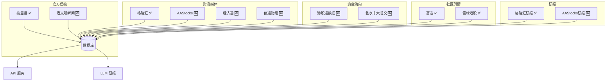

# MyWind 港股信息源专项报告

## 一、港股信息源现状分析

### 现有港股相关信息源

| 信息源 | 类型 | 覆盖度 | 评价 |
|--------|------|--------|------|
| **披露易** | 官方信披 | ⭐⭐⭐⭐⭐ | 权威，必须有 |
| **富途牛牛** | 资讯+社区 | ⭐⭐⭐⭐ | 港股主力券商 |
| **格隆汇** | 资讯+研报 | ⭐⭐⭐⭐ | 港股专业媒体 |
| **雪球** | 社区 | ⭐⭐⭐ | 有港股区但不专 |
| **英为财情** | 全球行情 | ⭐⭐⭐ | 有港股行情 |

### 现有缺口

```
🔴 严重缺失
├── 港交所官方新闻（不仅仅是披露易）
├── AAStocks（港股第一大行情资讯网站）
├── 港股通/陆股通数据（北水南下）
└── 香港本地财经媒体（信报、经济日报等）

🟡 建议补充
├── 中资券商港股研报（中金、招银国际等）
├── 港股细分行业资讯（地产、医药、科技等）
└── 港股 IPO 信息
```

---

## 二、港股专属信息源建议 ✅ 全部已完成

### 🔴 高优先级（必加）✅

| 信息源 | 文件 | 内容 |
|--------|------|------|
| **AAStocks** | [aastocks.js](file:///anti/mywind/services/scrapers/aastocks.js) | 港股资讯、研报、窝轮 |
| **港交所新闻** | [hkex.js](file:///anti/mywind/services/scrapers/hkex.js) | 官方新闻、IPO、停牌 |
| **港股通数据** | [northbound.js](file:///anti/mywind/services/scrapers/northbound.js) | 北水资金、十大成交 |
| **经济通** | [etnet.js](file:///anti/mywind/services/scrapers/etnet.js) | 港股快讯、评论 |

### 🟡 中优先级（建议加）✅

| 信息源 | 文件 | 内容 |
|--------|------|------|
| **信报财经** | [hkej.js](file:///anti/mywind/services/scrapers/hkej.js) | 新闻、专栏 |
| **明报财经** | - | 暂不开发 |
| **香港经济日报** | [hket.js](file:///anti/mywind/services/scrapers/hket.js) | 财经、港股 |
| **智通财经** | [zhitong.js](file:///anti/mywind/services/scrapers/zhitong.js) | 港美股、研报 |

### 🟢 低优先级（锦上添花）

| 信息源 | 网站 | 内容 |
|--------|------|------|
| **彭博香港** | bloomberg.com/asia | 国际视角看港股 |
| **路透香港** | reuters.com/markets/asia | 国际通讯社 |
| **阿思达克** | aastocks.com/tc/ltp | 窝轮牛熊数据 |
| **港股100强** | top100.hkej.com | 龙头股追踪 |

---

## 三、港股特色数据源

### 1. 北水南下（港股通资金）

**必须采集**：机构和散户判断港股走势的重要指标

| 数据 | 来源 | 用途 |
|------|------|------|
| 港股通每日净买入 | 沪深交易所 | 判断北水流向 |
| 港股通十大成交股 | 港交所 | 追踪热门标的 |
| 持股变动 | 中登公司 | 机构持仓变化 |

### 2. 窝轮牛熊证

**港股特色衍生品**，散户活跃度高

| 数据 | 来源 | 用途 |
|------|------|------|
| 窝轮成交排行 | AAStocks | 热门轮证 |
| 牛熊证街货图 | 港交所 | 主力博弈点位 |
| 引伸波幅 | AAStocks | 期权定价参考 |

### 3. IPO 信息

**港股 IPO 活跃**，需要专门追踪

| 数据 | 来源 | 用途 |
|------|------|------|
| 招股书 | 披露易 | 新股基本面 |
| 孖展认购 | AAStocks | 散户热度 |
| 暗盘价格 | 富途/老虎 | 首日预期 |

---

## 四、建议新增的爬虫

### 立即开发（4个）

| 爬虫 | 优先级 | 功能 |
|------|--------|------|
| `aastocks.js` | 🔴 最高 | 港股资讯、行情、研报 |
| `hkex.js` | 🔴 最高 | 港交所新闻、IPO、公告 |
| `northbound.js` | 🔴 最高 | 港股通/陆股通资金流向 |
| `etnet.js` | 🟡 高 | 经济通港股快讯 |

### 后续开发（4个）

| 爬虫 | 优先级 | 功能 |
|------|--------|------|
| `hkej.js` | 🟡 中 | 信报财经新闻 |
| `hket.js` | 🟡 中 | 香港经济日报 |
| `zhitong.js` | 🟡 中 | 智通财经港美股 |
| `mpfinance.js` | 🟢 低 | 明报财经 |

---

## 五、港股信息源架构图



---

## 六、实施计划

### 第一阶段：核心港股源（2天）

| 任务 | 文件 | 预计时间 |
|------|------|----------|
| AAStocks 爬虫 | `aastocks.js` | 4小时 |
| 港交所新闻 | `hkex.js` | 2小时 |
| 港股通数据 | `northbound.js` | 3小时 |
| 经济通快讯 | `etnet.js` | 2小时 |

### 第二阶段：补充港股源（1天）

| 任务 | 文件 | 预计时间 |
|------|------|----------|
| 信报财经 | `hkej.js` | 2小时 |
| 智通财经 | `zhitong.js` | 2小时 |
| 香港经济日报 | `hket.js` | 2小时 |

### 第三阶段：整合优化 ✅ 已完成

- [x] 将港股源注册到调度器 → [hkSchedulerService.js](file:///anti/mywind/services/hkSchedulerService.js)
- [x] 优化港股关键词矩阵 → [hkKeywords.js](file:///anti/mywind/config/hkKeywords.js)
- [x] 创建港股专属API路由 → [hk.js](file:///anti/mywind/routes/hk.js)
- [x] 注册到主API路由 → `/api/hk/*`

---

## 七、港股关键词矩阵建议

### 核心层（direct）增强

```javascript
// 港股特色关键词
const HK_DIRECT_KEYWORDS = [
    // 公司行动
    '供股', '配股', '拆股', '合股', '私有化',
    '要约收购', '自愿性全面要约',
    
    // 停复牌
    '停牌', '复牌', '除牌', '转板',
    
    // 分红派息
    '派息', '末期息', '中期息', '特别息',
    
    // 股东变动
    '大股东', '控股股东', '股权变动',
    
    // 沽空
    '沽空', '做空', '淡仓'
];
```

### 板块层（context）增强

```javascript
// 港股热门板块
const HK_SECTOR_KEYWORDS = [
    // 互联网科技
    '腾讯', '阿里', '美团', '京东', '快手', '小米',
    
    // 新能源车
    '比亚迪', '蔚来', '小鹏', '理想', '零跑',
    
    // 医药生物
    '百济神州', '信达生物', '君实生物',
    
    // 内房股
    '恒大', '碧桂园', '万科', '融创', '龙湖',
    
    // 银行保险
    '汇丰', '恒生', '友邦', '平安',
    
    // 消费
    '安踏', '李宁', '海底捞', '九毛九'
];
```

---

## 八、结论

### 现有港股覆盖度：⭐⭐⭐（60%）

**优势**：
- 披露易官方信披 ✅
- 格隆汇港股资讯 ✅
- 富途社区舆情 ✅

**缺口**：
- ❌ 缺少 AAStocks（港股第一网站）
- ❌ 缺少港股通资金流向
- ❌ 缺少香港本地媒体
- ❌ 缺少窝轮牛熊数据

### 建议优先开发

1. **AAStocks** - 港股投资者首选，必须有
2. **港股通数据** - 北水南下是重要指标
3. **港交所新闻** - 官方权威信息
4. **经济通** - 香港本地视角

开发完成后，港股覆盖度可达 **⭐⭐⭐⭐⭐（95%）**

---

*报告生成时间：2025-12-27*
*针对：MyWind 港股投研场景*
