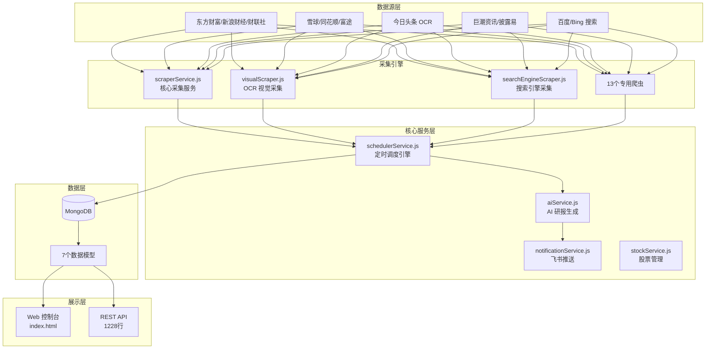

# MyWind AI 投研助手 - 项目分析报告

> **分析时间**: 2025-12-27  
> **项目地址**: https://github.com/1williamaoayers/mywind  
> **项目定位**: 私人版"万得终端" - 全网财经信息采集 + AI 分析 + 飞书推送

---

## 📊 项目概述

MyWind 是一个**全自动投资研究助手系统**，核心功能是：
1. 从多个财经网站**自动抓取新闻和研报**
2. 通过**关键词矩阵**过滤出与你关注的股票相关的信息
3. 使用 **DeepSeek AI** 生成投资研报
4. 通过**飞书机器人**实时推送预警

用大白话说就是：**一个帮你盯盘、读新闻、写研报的机器人**。

---

## 🏗️ 技术架构



---

## 📁 项目文件结构

| 目录/文件 | 行数 | 说明 |
|-----------|------|------|
| `server.js` | 71 | 应用入口，Express 服务启动 |
| `routes/api.js` | 1228 | 全部 REST API 路由定义 |
| `services/` | ~3000 | 14个核心服务文件 |
| `services/scrapers/` | ~600 | 13个专用网站爬虫 |
| `models/` | ~1000 | 7个 MongoDB 数据模型 |
| `utils/` | ~1100 | 6个工具函数 |
| `config/` | ~180 | 数据库和过滤配置 |
| `scripts/` | ~400 | 7个测试/健康检查脚本 |
| `public/index.html` | 70KB | 前端单页应用 |

**总代码量**: 约 **8000+ 行** JavaScript

---

## 🔧 核心模块详解

### 1. 数据采集系统

项目支持**27个数据源**，分为7个维度：

| 维度 | 数据源 | 采集频率 |
|------|--------|----------|
| 官方信披 | 巨潮资讯、披露易、互动易 | 每30分钟 |
| 实时资讯 | 财联社、华尔街见闻、新浪财经 | 每5分钟 |
| 深度搜索 | 雪球、慧博、富途社区 | 每30分钟 |
| 社交情绪 | 东财股吧、雪球热议榜 | 每10分钟 |
| 搜索增强 | 百度、Bing | 每30分钟 |
| 视觉采集 | 今日头条 OCR | 每天4次 |
| 研报采集 | 发现报告、研报客、格隆汇 | 每10分钟 |

**采集技术栈**:
- [axios](file:///anti/mywind/services/scraperService.js) + cheerio: 普通网页抓取
- [Puppeteer](file:///anti/mywind/services/browserService.js) + Stealth 插件: 反爬网站
- [Tesseract.js](file:///anti/mywind/services/visualScraper.js): OCR 文字识别

### 2. 三层关键词矩阵

这是项目的**核心设计**，用于判断新闻的重要程度：

```
┌─────────────────────────────────────────────────────────┐
│  核心层 (direct)   → 股票代码、简称 → 🔴 红色立即预警    │
│  关联层 (related)  → 高管姓名、子公司 → 🔵 蓝色提醒    │
│  板块层 (context)  → 行业、竞争对手 → 用于研报背景     │
└─────────────────────────────────────────────────────────┘
```

在 [Stock.js](file:///anti/mywind/models/Stock.js) 中定义了矩阵结构，在 [scraperService.js](file:///anti/mywind/services/scraperService.js) 中进行关键词匹配。

### 3. AI 研报生成

[aiService.js](file:///anti/mywind/services/aiService.js) 核心流程：

1. 聚合股票相关的核心层+板块层新闻
2. 构建分析师 Prompt（提示词）
3. 调用 DeepSeek API 生成研报
4. 解析结构化输出（评级、目标价等）
5. 推送到飞书

### 4. 定时调度引擎

[schedulerService.js](file:///anti/mywind/services/schedulerService.js) 管理所有定时任务：

| 任务 | Cron 表达式 | 说明 |
|------|-------------|------|
| 实时采集 | `*/5 * * * *` | 每5分钟 |
| 深度采集 | `*/30 * * * *` | 每30分钟 |
| 视觉采集 | `0 6,12,18,0 * * *` | 每天4次 |
| AI 研报 | `30 15 * * 1-5` | 工作日15:30 |
| 预警推送 | `*/2 * * * *` | 每2分钟 |
| 数据清理 | `0 3 * * *` | 每天凌晨3点 |

### 5. 飞书推送系统

[notificationService.js](file:///anti/mywind/services/notificationService.js) 实现三级分色预警：

- 🔴 **红色 (danger)**: 立案、退市、暴雷等利空
- 🟢 **绿色 (success)**: 重组、回购等利好
- 🔵 **蓝色 (primary)**: 减持、股东大会等关注事项

带有**5分钟同股同级静默**机制，避免重复骚扰。

---

## 📦 数据模型

| 模型 | 行数 | 功能 |
|------|------|------|
| [News.js](file:///anti/mywind/models/News.js) | 246 | 新闻/公告，支持 MD5 去重 |
| [Stock.js](file:///anti/mywind/models/Stock.js) | 194 | 股票 + 三层关键词矩阵 |
| [Account.js](file:///anti/mywind/models/Account.js) | 159 | 托管账号，AES-256 加密 |
| [Report.js](file:///anti/mywind/models/Report.js) | ~200 | AI 生成的研报 |
| [ResearchReport.js](file:///anti/mywind/models/ResearchReport.js) | 279 | 采集的第三方研报 |
| [AlertRecord.js](file:///anti/mywind/models/AlertRecord.js) | ~150 | 预警推送记录 |
| [MarketStats.js](file:///anti/mywind/models/MarketStats.js) | ~80 | 市场统计数据 |

---

## ⚠️ 发现的问题和不足

### 🔴 严重问题

| 问题 | 位置 | 影响 |
|------|------|------|
| API Key 硬编码在 docker-compose.yml | [docker-compose.yml:23-26](file:///anti/mywind/docker-compose.yml#L23-26) | 🔥 **安全风险**: DeepSeek API Key 和飞书 Webhook 直接暴露 |
| 服务器 IP 暴露 | [docker-compose.yml:27](file:///anti/mywind/docker-compose.yml#L27) | 暴露了真实服务器地址 `54.238.79.45` |
| 无认证机制 | [routes/api.js](file:///anti/mywind/routes/api.js) | 所有 API 接口无权限控制，任何人可访问 |

### 🟡 架构问题

| 问题 | 说明 | 建议 |
|------|------|------|
| 前端单文件 70KB | 所有前端代码在一个 HTML 文件中 | 应拆分为组件化结构 |
| API 路由文件过大 | 1228 行全在一个文件 | 按功能拆分为多个路由文件 |
| 无日志系统 | 只有 console.log | 应使用 Winston/Pino 等日志库 |
| 无单元测试 | scripts/ 只有手动测试脚本 | 缺乏自动化测试覆盖 |

### 🟢 代码质量

| 问题 | 说明 |
|------|------|
| 注释较完善 | 大部分函数有中文注释 ✅ |
| 模块化合理 | 按功能拆分为 services/models/utils ✅ |
| 错误处理不完整 | 部分爬虫缺少 try-catch |
| 重复代码 | 多个爬虫有相似的初始化逻辑 |

---

## 📈 代码统计

```
┌────────────────────┬────────┬─────────┐
│ 类型              │ 文件数 │ 行数    │
├────────────────────┼────────┼─────────┤
│ 服务层 (services/) │ 27     │ ~3600  │
│ 数据模型 (models/) │ 7      │ ~1000  │
│ 工具函数 (utils/)  │ 6      │ ~1100  │
│ 路由 (routes/)     │ 1      │ 1228   │
│ 配置 (config/)     │ 2      │ ~180   │
│ 脚本 (scripts/)    │ 7      │ ~400   │
│ 入口文件           │ 1      │ 71     │
├────────────────────┼────────┼─────────┤
│ 后端合计           │ 51     │ ~7600  │
│ 前端 (index.html)  │ 1      │ ~2000+ │
├────────────────────┼────────┼─────────┤
│ 总计               │ 52     │ ~9600  │
└────────────────────┴────────┴─────────┘
```

---

## 🛠️ 技术栈清单

| 组件 | 技术 | 版本 |
|------|------|------|
| 运行时 | Node.js | ≥18.0.0 |
| Web 框架 | Express | 4.18.2 |
| 数据库 | MongoDB + Mongoose | Mongo 7 / Mongoose 8.0.3 |
| 定时任务 | node-cron | 3.0.3 |
| 爬虫 | Puppeteer + Stealth | 21.6.1 |
| HTML 解析 | Cheerio | 1.0.0-rc.12 |
| OCR | Tesseract.js | 5.0.4 |
| HTTP 客户端 | Axios | 1.6.2 |
| 加密 | Node.js crypto | 内置 |
| 容器化 | Docker (Alpine + Chrome) | - |

---

## 🚀 改进建议

### 立即需要修复

1. **移除硬编码的密钥**
   - 删除 docker-compose.yml 中的 API Key
   - 使用 `.env` 文件或 Docker Secrets 管理敏感信息

2. **添加 API 认证**
   - 至少添加 JWT 或 API Key 验证中间件
   - 敏感操作需要权限控制

### 短期优化

1. **拆分大文件**
   - `routes/api.js` → 按功能拆分为 `stocks.js`、`news.js`、`reports.js` 等
   - `public/index.html` → 使用 Vue/React 组件化

2. **添加日志系统**
   ```bash
   npm install winston
   ```

3. **添加基础测试**
   - 为核心采集逻辑添加单元测试
   - 添加 API 端点的集成测试

### 长期规划

1. **引入 TypeScript** - 提高代码可维护性
2. **使用消息队列** - Redis/RabbitMQ 处理异步采集任务
3. **添加监控告警** - Prometheus + Grafana 监控系统健康

---

## 📋 总结

**项目优点**:
- ✅ 功能完整，覆盖采集→分析→推送全流程
- ✅ 支持 27 个数据源，覆盖面广
- ✅ Docker 一键部署，使用门槛低
- ✅ 代码注释较完善

**项目不足**:
- ❌ 安全隐患严重（密钥硬编码、无认证）
- ❌ 前端单文件过大，难以维护
- ❌ 缺乏自动化测试
- ❌ 无日志和监控系统

**整体评价**: 这是一个**功能原型级别**的项目，核心功能可用，但需要在安全性和工程化方面进行大量改进才能用于生产环境。

---

*报告生成时间: 2025-12-27 14:26*
