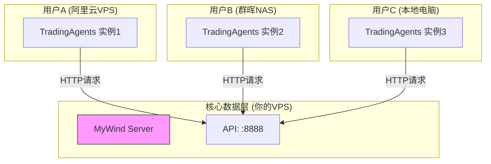

# MyWind & dTraingAgents 分离部署方案

> **方案类型**: 分布式架构 (推荐生产环境)  
> **核心思想**: MyWind作为中心化数据服务，TradingAgents作为分布式客户端  
> **适用场景**: 多用户、多实例、VPS/NAS混用环境

---

## 🏗️ 架构概览



---

## 📦 方案一：MyWind 服务端部署 (数据中心)

**目标**: 部署一台稳定运行的服务器，对外提供AkShare数据API。

### 1. 部署文件 (`docker-compose-mywind.yml`)

```yaml
version: '3.8'

services:
  mywind:
    image: williamaoayers/mywind-aktools:latest
    container_name: mywind
    ports:
      - "8888:8888"  # 核心API端口
    environment:
      - TZ=Asia/Shanghai
      - AKTOOLS_worker_connections=1000  # 增加并发连接数
    healthcheck:
      test: ["CMD", "curl", "-f", "http://localhost:8888/"]
      interval: 30s
      timeout: 10s
      retries: 3
    restart: unless-stopped
    
    # 资源限制建议 (VPS)
    deploy:
      resources:
        limits:
          cpus: '1.0'
          memory: 1G
```

### 2. 推荐配置
*   **服务器**: 2核 4G 内存以上 (推荐)
*   **带宽**: 5Mbps 以上 (数据传输量较大)
*   **防火墙**: 开放 TCP 8888 端口

### 3. 安装脚本 (`install-mywind.sh`)

```bash
#!/bin/bash
# Server端一键安装
echo "🚀 开始部署 MyWind 数据中心..."
curl -fsSL https://raw.githubusercontent.com/williamaoayers/mywind/main/docker-compose-mywind.yml -o docker-compose.yml
docker-compose up -d
echo "✅ 部署完成！API地址: http://$(curl -s ifconfig.me):8888"
```

---

## 📦 方案二：TradingAgents 客户端部署 (用户端)

**目标**: 用户在自己的VPS或NAS上部署TradingAgents，连接到MyWind数据中心。

### 1. 部署文件 (`docker-compose-tradingagents.yml`)

```yaml
version: '3.8'

services:
  tradingagents:
    image: williamaoayers/tradingagents:latest
    container_name: tradingagents
    ports:
      - "8501:8501"  # Web UI端口
    environment:
      # 关键配置：指向MyWind服务器
      - MYWIND_API_URL=http://YOUR_MYWIND_IP:8888/api/public
      - TZ=Asia/Shanghai
    restart: unless-stopped
    
    # NAS优化配置
    logging:
      driver: "json-file"
      options:
        max-size: "10m"
        max-file: "3"
```

### 2. 适配设备
*   **VPS**: 简单Docker环境
*   **NAS (群晖/威联通)**: 支持Docker/Container Manager的机型 (`x86_64` 或 `arm64`)

### 3. 安装脚本 (`install-tradingagents.sh`)

```bash
#!/bin/bash
# Client端一键安装
echo "🚀 开始部署 TradingAgents..."
read -p "请输入MyWind服务器IP地址: " SERVER_IP
export MYWIND_IP=$SERVER_IP

curl -fsSL https://raw.githubusercontent.com/williamaoayers/tradingagents/main/docker-compose-tradingagents.yml -o docker-compose.yml
# 自动替换配置
sed -i "s/YOUR_MYWIND_IP/$SERVER_IP/g" docker-compose.yml

docker-compose up -d
echo "✅ 部署完成！访问地址: http://localhost:8501"
```

---

## 🔄 维护与更新策略

### 服务端 (MyWind)
*   **频率**: 每周/每月检查一次镜像更新
*   **操作**: `docker-compose pull && docker-compose up -d`
*   **风险**: 更新期间服务会有短暂中断 (建议配置Nginx热备或在低峰期操作)

### 客户端 (TradingAgents)
*   **频率**: 用户自行决定，通常跟随功能发布更新
*   **操作**: 一键更新脚本
*   **依赖**: 只要MyWind API协议不变更，客户端无需强制同步更新

---

## 📝 下一步行动
1.  构建并推送 `williamaoayers/mywind-aktools` Docker镜像。
2.  修改 TradingAgents 代码以支持 `MYWIND_API_URL` 环境变量。
3.  构建并推送 `williamaoayers/tradingagents` Docker镜像。
4.  将上述 YAML 和 SH 文件上传至 GitHub 仓库供用户下载。
